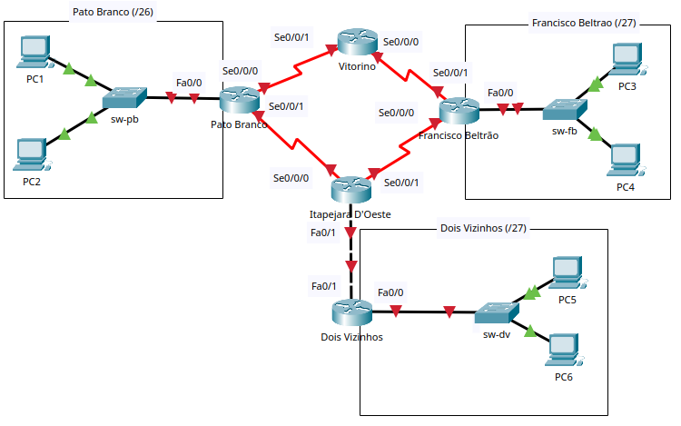

# Trabalho: Integração de habilidades - 2025/1
## Disciplina: Redes de Computadores
### Cursos: Engenharia de Computação / Tecnologia em Análise e Desenvolvimento de Sistemas

## Objetivo
Este trabalho prático tem como objetivo proporcionar aos alunos a aplicação dos conceitos de redes de computadores por meio do desenvolvimento de uma topologia de rede que simula um cenário real. Ao concluir esta atividade, você estará demonstrando sua capacidade de projetar, configurar e validar diferentes ambientes de rede. Comisso, você será capaz de desenvolver as seguintes habilidades:

* Projetar a rede lógica, definindo o esquema de endereçamento e o funcionamento dos dispositivos;
* Configurar a topologia física e lógica;
* Definir e implementar rotas estáticas para viabilizar a comunicação entre redes remotas;
* Realizar a documentação completa da rede, incluindo topologia, endereçamento, configurações e testes;
* Configurar switches, roteadores e dispositivos finais, garantindo a comunicação plena entre todos os elementos da rede;
* VVerificar e validar a conectividade entre os dispositivos, utilizando os protocolos IPv4 e IPv6.

## Descrição da atividade e topologia
Neste trabalho, você deverá projetar e implementar uma topologia de rede que interliga centros de pesquisa associados aos campi da UTFPR localizados na região sudoeste do Paraná, nas cidades de Pato Branco, Francisco Beltrão e Dois Vizinhos. A topologia a ser utilizada como referência está apresentada na  [Figura 1](#figura1). 


Durante o desenvolvimento da atividade, será necessário realizar o planejamento da rede, configurar os equipamentos de interconexão (roteadores e switches), além dos dispositivos finais, e assegurar que todos os centros estejam corretamente interligados, com roteamento funcional tanto em IPv4 quanto em IPv6.

Além das configurações, a entrega deste trabalho deverá contemplar a documentação detalhada do projeto de rede, contendo informações como a tabela das sub-redes, tabelas de endereçamento dos dispositivos, configurações realizadas e evidências de testes de conectividade.


## Tarefa 1: Projetar e documentar as sub-redes

Utilize o bloco de endereços **IPv4 200.136.**N**.0/24** e **IPv6 2001:DB8:CAFE:**NN**00::/56** para criar as sub-redes, de acordo com as seguintes especificações:

- O valor de **N** e **NN** correspondem aos dois últimos dígitos do seu RA (Registro Acadêmico).  

- A sub-rede **IPv4** para a LAN de **Pato Branco** deve ter o prefixo **/26**, as sub-redes das LANs de **Francisco Beltrão** e **Dois Vizinhos** devem ter o prefixo **/27**.
  - Deve-se prever a expansão da rede com três novos centros de pesquisa, localizados na região oeste do Paraná, nas cidades de Toledo, Medianeira e Santa Helena, as sub-redes para esses três centros deve utilizar o prefixo **/27**.

- A sub-rede **IPv6** para todas as LANs deve ter o prefixo **/64**.

- O prefixo das sub-redes para os enlaces WAN deve ser:
  - **/30** para IPv4
  - **/112** para IPv6

- Alocação das sub-redes para LANs:
  - Utilize a **primeira sub-rede** para a LAN de **Pato Branco**.
  - Utilize a **segunda sub-rede** para a LAN de **Francisco Beltrão**.
  - Utilize a **terceira sub-rede** para a LAN de **Dois Vizinhos**.
  - Reserve a **quarta, quinta e sexta sub-redes** para os futuros centros de pesquisa que estão em implantação na região oeste do estado.

- Alocação das sub-redes para WANs:
  - No IPv4, utilize a **última sub-rede /27 disponível** para subdividir em blocos **/30**, destinados aos enlaces entre roteadores (**pb-vit, vit-fb, fb-ita, ita-pb, ita-dv**, e também os enlaces para os novos centros de pesquisa).
  - No IPv6, utilize a **última sub-rede /64 disponível** para subdividir em blocos **/112**, destinados aos mesmos enlaces entre roteadores.

> 💡 **Dica:** Você pode incluir as informações de sub-redes diretamente na topologia (no Packet Tracer) para facilitar a visualização e organização do projeto.

- Documentar as sub-redes dos dispositivos conforme o [modelo](trabalho-documentacao-modelo.md).


## Tarefa 2: Documentar os endereços lógicos dos dispositivos

Os endereços IP das interfaces dos Hosts e Roteadores devem ser atribuídos da seguinte maneira:

- O PC1 usará o **terceiro** endereço de host válido da sub-rede de **Pato Branco**;
- O PC2 usará o **quarto** endereço de host válido da sub-rede de **Pato Branco**;
- O PC3 usará o **terceiro** endereço de host válido da sub-rede de **Francisco Beltrão**;
- O PC4 usará o **quarto** endereço de host válido da sub-rede de **Francisco Beltrão**;
- O PC5 usará o **terceiro** endereço de host válido da sub-rede de **Dois Vizinhos**;
- O PC6 usará o **quarto** endereço de host válido da sub-rede de **Dois Vizinhos**;

- Os switches usarão o **segundo** endereço de host válido da respectiva LAN;

- Atribuir à interface Fa0/0 do roteador **Pato Branco** o **primeiro** endereço de host válido da sub-rede de **Pato Branco**;
- Atribuir à interface Fa0/0 do roteador **Francisco Beltrão** o **primeiro** endereço de host válido da sub-rede de **Francisco Beltrão**;
- Atribuir à interface Fa0/0 do roteador **Dois Vizinhos** o **primeiro** endereço de host válido da sub-rede de **Dois Vizinhos**;

- Atribuir à interface Se0/0/0 de cada roteador o **primeiro** endereço de host válido da sub-rede de ligação entre os roteadores.  
  - Esta interface será o **DCE**, com clock rate de **56000**.

- Atribuir à interface Se0/0/1 de cada roteador o **segundo** endereço de host válido da sub-rede de ligação entre os roteadores;

- Atribuir à interface Fa0/1 do roteador **Itapejara** o **primeiro** endereço de host válido da sub-rede de ligação entre os roteadores;

- Atribuir à interface Fa0/1 do roteador **Dois Vizinhos** o **segundo** endereço de host válido da sub-rede de ligação entre os roteadores;

- Para IPv6, também deve-se especificar os endereços de link-local para as conexões, sendo:
  - Nos computadores deve-se usar **EUI-64** para atribuição do endereço de **link-local**;
  - Nas ligações (WAN) entre roteadores deve-se usar **EUI-64**
  - Nas ligações entre o roteador e as LANs deve ser especificar manualmente os endereços usando o endereço FE80::1, isto é, todas as interfaces Fa0/0 terão o IPv6 de link-local igual FE80::1


- Documentar o endereçamento dos dispositivos conforme o [modelo](trabalho-documentacao-modelo.md).
  


## Tarefa 3: Documentar as tabelas de roteamento

- Definir as rotas em todos os roteadores de forma que os computadores de **Pato Branco** alcancem os computadores dos centros de pesquisa no **sentido horário**, ou seja, através da rota:

  **Pato Branco → Vitorino → Francisco Beltrão**

  e sejam respondidos pelo caminho oposto:

  **Francisco Beltrão → Itapejara D’Oeste → Pato Branco**.

  O fluxo de ida deve ser feito via Vitorino e as respostas pelo caminho via Itapejara D’Oeste.

- Documentar as tabelas de roteamento para IPv4 e IPv6, conforme o [modelo](trabalho-documentacao-modelo.md).

  - Não é obrigatório documentar as redes diretamente conectadas.
    

## Tarefa 4: Configuração básica dos dispositivos no Packet Tracer

- **Criar a topologia no Packet Tracer**, conforme ilustrado na **Figura 1**:
  - Utilize *roteadores modelo 2811* (adicione uma interface WIC-2T no slot 0 para as conexões WAN) e *switches modelo 2960*, equipamentos disponíveis no laboratório de redes;
  - Na área de trabalho de cada topologia, informe o **RA + Nome do aluno**;
  - Recomenda-se inserir as informações de endereçamento na área de trabalho do Packet Tracer para facilitar a visualização.

- **Nomear os dispositivos intermediários (roteadores e switches) no IOS** conforme o padrão:
  - Roteador Pato Branco: `r-pb-nnn`
  - Roteador Francisco Beltrão: `r-fb-nnn`
  - Roteador Itapejara: `r-ita-nnn`
  - Roteador Vitorino: `r-vit-nnn`
  - Roteador Dois Vizinhos: `r-dv-nnn`
  - Switch Pato Branco: `sw-pb-nnn`
  - Switch Francisco Beltrão: `sw-fb-nnn`
  - Switch Dois Vizinhos: `sw-dv-nnn`
  
  > **Obs:** `nnn` refere-se às iniciais do seu nome, por exemplo: `r-pb-ff` / `sw-pb-ff` (Fábio Favarim).

- **Endereçar todas as interfaces de rede** dos computadores (IPv4/máscara, IPv6/prefixo e gateway), roteadores (IPv4/máscara, IPv6/prefixo) e switches (IPv4 na SVI e gateway), conforme documentado no **Quadro 2**.
  - A interface serial `Se0/0/0` será o DCE e deve ser configurada com o clock rate de 56000:
    ```
    clock rate 56000
    ```
    aplicado na interface `Se0/0/0`.

- **Inserir descrições nas interfaces dos roteadores**, indicando a rede ou enlace ao qual estão conectadas, por exemplo:
  - `description LAN Pato Branco`
  - `description Enlace pb-vit`
  - `description Enlace vit-fb`

- **Configurar as rotas estáticas** conforme documentado na Tarefa 3:
  - Lembre-se que somente é necessário configurar rotas estáticas para redes remotas; rotas para redes diretamente conectadas são criadas automaticamente pelos roteadores.


## Tarefa 5: Testar a topologia

- Execute o comando **ping** a partir do PC0 para todas as outras interfaces da topologia, incluindo dispositivos finais e intermediários.
- Realize os testes tanto para **IPv4** quanto para **IPv6**, utilizando o prompt de comando (*command prompt*).
- Verifique a conectividade e certifique-se de que todas as máquinas e roteadores respondem corretamente.
- Sugestão: Documente os testes, conforme o [modelo](trabalho-documentacao-modelo.md).
 


## Avaliação
* As Tarefas 1 a 5 é individual, porém, poderá ser feita em grupo! 
	 * No entanto, cada aluno deve fazer a sua atividade e ter total domínio do que foi feito.
* Entrega 1 - Entregar, via moodle, arquivo conforme o [modelo](trabalho-documentacao-modelo.md), nomeado como trabalho-documentacao-NomeAluno, em formato .md, contendo:
    * RA e Nome do aluno;
    * Documentação correspondente as Tarefas 1, 2 e 3;
    * Outras informações que achar relevante;
    * Data da entrega: até às 23h59min do dia **05/06/2025**
        * Não será aceita entrega após o prazo;
        * Obs: no dia **06/06/2025, no início da manhã,** será disponibilizado o gabarito para conferência e ajustes caso necessário;
* Entrega 2 – Entrega, via moodle, arquivo compactado nomeado trabalho-nomealuno.zip, contendo:
	 * arquivo com a documentação da Entrega 1, corrigida, se for o caso;
	 * arquivo em formato .pkt (Packet Tracer), nomeado como trabalho-topologia-NomeAluno.pkt com a topologia configurada e funcionando no Packet Tracer (Tarefas 4 e 5).
	    * Data da entrega: até o início da aula do dia **16/06/2025 (Tecnologia) ou 17/06/2025 (Engenharia)**;
            * Não será aceita entrega após o prazo;
           
          
## Critérios de Avaliação

### Entrega 1 – Documentação
- **Tarefa 1:** 0 pontos (realizada em sala de aula com o professor)
- **Tarefa 2:** 1 ponto
- **Tarefa 3:** 1 ponto

### Entrega 2 – Topologia Funcionando no Packet Tracer
- **Tarefa 4:** 8 pontos  (4 pontos para IPv4 + 4 pontos para IPv6)

### Teste de autoria
- Não gera nota, mas é critério obrigatório para validar a autoria do trabalho, caso necessário.
- Será agendado individualmente até o último dia letivo do semestre.